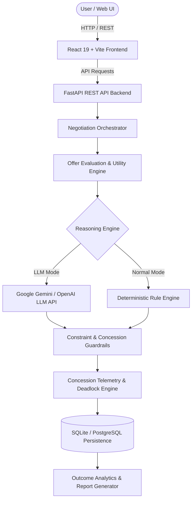
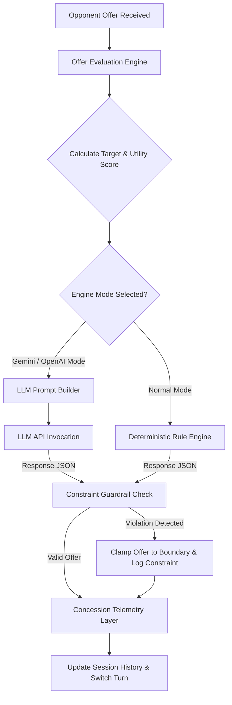

# NegoMind AI: AI-Driven Multi-Agent Negotiation Training & Simulation Platform

An academic and enterprise-grade multi-agent negotiation simulation and training platform featuring a **Python FastAPI backend**, **dual-mode reasoning engine** (Google Gemini LLM / OpenAI & Deterministic Rule Engine), **Role-Aware Concession Telemetry**, and a modern **React 19 + Vite frontend**.

> 🔗 **GitHub Repository**: [https://github.com/hemalathabora/Infosys-AI-Negotiation](https://github.com/hemalathabora/Infosys-AI-Negotiation)

---

## 📋 Executive Overview

**NegoMind AI** simulates dynamic, multi-round negotiations between autonomous AI agents or between human users and AI agents. It evaluates structured offers against hard numeric constraints, tracks concession dynamics across rounds, detects negotiation deadlocks, and generates analytical outcome reports.



---

## 🏆 Feature Verification Matrix

| Feature / Subsystem | Milestone | Primary Source File(s) | Status | Evidence / Verification |
|---|---|---|---|---|
| **Agent Profile System & Scenarios** | M1 | `backend/app/models/agent.py`, `backend/app/services/negotiation_service.py` | ✅ IMPLEMENTED | 3 verified scenarios (Vendor Pricing, Job Offer, Project Budget) with numeric boundaries. |
| **Negotiation State & Persistence** | M1 | `backend/app/models/negotiation.py`, `backend/app/database.py` | ✅ IMPLEMENTED | SQLAlchemy models tracking rounds, turns, status, offers, and transcript in SQLite/PostgreSQL. |
| **Turn Orchestration** | M1 | `backend/app/services/orchestrator.py` | ✅ IMPLEMENTED | Turn-taking engine with turn switching, maximum round limits, and state transitions. |
| **LLM Reasoning (Gemini & OpenAI)** | M2 | `backend/app/services/llm_reasoning.py` | ✅ IMPLEMENTED | Pydantic JSON schema generation via `google-generativeai`, `google-genai`, and `openai`. |
| **Normal / Rule-Based Engine** | M2 | `backend/app/services/decision_logic.py`, `llm_reasoning.py` | ✅ IMPLEMENTED | Deterministic fallback engine (`mock_llm_reasoning`) executing rule-based decision trees. |
| **Constraint Enforcement Guardrail** | M2 | `backend/app/services/llm_reasoning.py` | ✅ IMPLEMENTED | `validate_agent_constraints` clamps buyer budget ceilings and seller price floors. |
| **Negotiation Arena UI** | M3 | `src/pages/NegotiationArena.jsx` | ✅ IMPLEMENTED | Real-time turn feed, AI reasoning overlays, stance indicators, and offer history. |
| **Simulation Mode (AI vs AI)** | M3 | `backend/app/services/orchestrator.py` | ✅ IMPLEMENTED | Automated turn execution between two AI agents until agreement, breakdown, or max rounds. |
| **Practice Mode (Human vs AI)** | M3 | `backend/app/services/orchestrator.py`, `src/pages/NegotiationArena.jsx` | ✅ IMPLEMENTED | Interactive human-in-the-loop negotiation with input validation and AI counter-responses. |
| **Concession Analytics Telemetry** | M3 | `backend/app/services/concession_tracking.py` | ✅ IMPLEMENTED | Single-source math engine calculating step size, step %, cumulative decay, ZOPA, and capacity. |
| **Deadlock Detection & Resolution** | M3 | `backend/app/services/deadlock_detection.py` | ✅ IMPLEMENTED | Stagnation detection, repeated offer checks, non-overlapping constraint breakdown, and suggestion logic. |
| **Outcome Screen & Session Summary** | M4 | `src/components/OutcomeScreen.jsx` | ✅ IMPLEMENTED | Visual breakdown of agreement terms, round count, transcript, and concession trajectory. |
| **Report Generation & Export** | M4 | `src/pages/Reports.jsx`, `src/services/negotiationReport.js` | ✅ IMPLEMENTED | Comprehensive report layout supporting browser print-to-PDF export (`window.print()`). |
| **Automated Test Suite** | M4 | `backend/tests/` | ✅ IMPLEMENTED | 62 passing pytest tests verifying all 4 milestones. |
| **Production Deployment Setup** | M4 | `backend/render.yaml`, `vercel.json` | ✅ IMPLEMENTED | Verified Render backend spec, Vercel frontend config, and Supabase PostgreSQL driver support. |

---

## 🎯 Project Milestones

### Milestone 1 — System & Agent Foundation
- **Purpose**: Establish core data models, agent profiles, negotiation scenarios, and persistence infrastructure.
- **Implementation**: Built agent schemas supporting roles (`buyer`, `vendor`, `candidate`, `employer`, `department_head`, `finance_director`), personas (`Aggressive`, `Collaborative`, `Risk-averse`), goals, and hard numerical boundaries (`maximum_price`, `minimum_price`, `quantity`). Configured SQLAlchemy database models for sessions, turns, and messages.
- **Verified Scenarios**:
  1. **Vendor Pricing Negotiation**: Buyer (Max $50,000) vs. Vendor (Min $42,000).
  2. **Job Offer Negotiation**: Candidate (Min $95,000) vs. Employer (Max $110,000).
  3. **Project Budget Allocation**: Department Head (Min $75,000) vs. Finance Director (Max $85,000).
- **Key Files**: `backend/app/models/agent.py`, `backend/app/models/negotiation.py`, `backend/app/services/negotiation_service.py`
- **Validation**: Verified by `backend/tests/test_agents.py` and `backend/tests/test_negotiation.py`.
- **Status**: ✅ IMPLEMENTED

### Milestone 2 — LLM Reasoning & Negotiation Logic
- **Purpose**: Implement contextual AI decision-making using LLMs alongside a deterministic rule engine and strict constraint guardrails.
- **Implementation**: Created dual reasoning pipelines:
  - **Gemini / LLM Mode**: Contextual prompt engineering passing full agent context, history, and opponent offers to Google Gemini (`google-generativeai`, `google-genai`) or OpenAI (`openai`), enforcing structured JSON output (`accept`, `counter`, `reject`, `offer`, `reasoning`).
  - **Normal Mode**: Deterministic rule-based engine (`mock_llm_reasoning` and `decide_action`) providing instant response generation without external API dependencies.
  - **Constraint Enforcement**: `validate_agent_constraints` detects and clamps out-of-bounds LLM counteroffers to agent boundaries.
- **Key Files**: `backend/app/services/llm_reasoning.py`, `backend/app/services/offer_evaluation.py`, `backend/app/services/decision_logic.py`
- **Validation**: Verified by `backend/tests/test_reasoning.py`, `backend/tests/test_offer_evaluation.py`, and `backend/tests/test_multi_round_vendor_pricing.py`.
- **Status**: ✅ IMPLEMENTED

### Milestone 3 — Negotiation Arena & Practice Mode
- **Purpose**: Build the interactive web UI and execution modes for both fully automated AI simulations and human interactive practice sessions.
- **Implementation**:
  - **Simulation Mode**: AI Agent ↔ AI Agent automated negotiation with step-by-step or run-to-completion capabilities.
  - **Practice Mode**: Human User ↔ AI Agent interactive negotiation allowing real-time offer submissions, turn validation, and AI counteroffer generation.
  - **Negotiation Arena UI**: Turn feed, stance badges, reasoning modal overlays, live offer history, and concession telemetry panels.
  - **Deadlock Detection**: Tracks price stagnation across turns and non-overlapping constraint boundaries, triggering resolution suggestions or breakdown states.
- **Key Files**: `src/pages/NegotiationArena.jsx`, `backend/app/services/orchestrator.py`, `backend/app/services/deadlock_detection.py`
- **Validation**: Verified by `backend/tests/test_practice_mode.py` and `backend/tests/test_milestone3.py`.
- **Status**: ✅ IMPLEMENTED

### Milestone 4 — Outcome, Reporting & Finalization
- **Purpose**: Deliver negotiation analytics, printable outcome reports, and end-to-end system testing.
- **Implementation**:
  - **Outcome Screen**: Displays negotiation results (`agreement`, `breakdown`, `deadlock`), agreement price, total rounds, transcript log, and objective satisfaction metrics.
  - **Reporting & Export**: Renders structured executive reports with KPI cards and transcript breakdown, featuring printable print stylesheet integration (`window.print()`).
  - **Analytics Engine**: Aggregates total sessions, win/agreement rates, average rounds, and scenario-level statistics.
- **Key Files**: `src/components/OutcomeScreen.jsx`, `src/pages/Reports.jsx`, `src/pages/Analytics.jsx`, `backend/app/services/analytics_service.py`
- **Validation**: Verified by `backend/tests/test_concession_tracking.py` and full 62-test pytest suite.
- **Status**: ✅ IMPLEMENTED

---

## 🎛️ Modes of Operation

NegoMind AI operates across two independent operational dimensions:

```
Participant Dimension:   Simulation Mode (AI ↔ AI)     VS    Practice Mode (Human ↔ AI)
Engine Dimension:        Gemini / LLM Mode (Contextual) VS    Normal Mode (Deterministic Rule Engine)
```

1. **Simulation Mode (AI vs AI)**: Both sides are controlled by autonomous AI agents running turn-by-turn.
2. **Practice Mode (Human vs AI)**: A human participant acts as one role (e.g., Buyer) while the AI controls the opponent.
3. **Gemini / LLM Mode**: Decisions and counteroffers are dynamically generated by Google Gemini or OpenAI based on prompt context.
4. **Normal Mode**: Decisions are generated deterministically by the local rule engine without API calls.

---

## ⚙️ Decision & Concession Engine Architecture



### Role-Aware Concession Metrics
- **Step Concession Amount**: Movement toward target position ($|\text{Offer}_{t} - \text{Offer}_{t-1}|$).
- **Step Concession Percentage**: $\frac{\text{Step Concession}}{\text{Initial Position} - \text{Target Position}} \times 100\%$.
- **Cumulative Concession**: Total sum of true concessions made by an agent across all rounds.
- **Rate of Concession Decay**: $\frac{\text{Avg(Early Concessions)} - \text{Avg(Recent Concessions)}}{\text{Avg(Early Concessions)}} \times 100\%$.
- **Remaining Concession Capacity**: Distance from current offer to agent's hard constraint limit.
- **ZOPA (Zone of Possible Agreement)**: Overlap between Buyer Maximum Limit and Vendor Minimum Floor ($\text{Max}_{\text{Buyer}} - \text{Min}_{\text{Vendor}}$).

---

## 📊 Negotiation Scenarios

| Scenario Name | Role 1 (Minimizer / Payer) | Role 2 (Maximizer / Receiver) | Objective & Constraints |
|---|---|---|---|
| **Vendor Pricing Negotiation** | Buyer (*Alex Morgan*)<br>Max Price: **$50,000** | Vendor (*Daniel Carter*)<br>Min Price: **$42,000** | Negotiate bulk component order price. ZOPA = $8,000. |
| **Job Offer Negotiation** | Employer (*Michael Anderson*)<br>Max Budget: **$110,000** | Candidate (*Sarah Mitchell*)<br>Min Salary: **$95,000** | Negotiate starting salary for engineering role. ZOPA = $15,000. |
| **Project Budget Allocation** | Finance Director (*James Wilson*)<br>Max Budget: **$85,000** | Department Head (*Olivia Bennett*)<br>Min Budget: **$75,000** | Negotiate quarterly project budget allocation. ZOPA = $10,000. |

---

## 🛠️ Technology Stack

| Layer | Technology | Purpose |
|---|---|---|
| **Frontend Framework** | React 19, Vite | Modern single-page web application UI |
| **Styling & Icons** | Tailwind CSS, Lucide React, GSAP | Dark-theme UI, animations, icon sets |
| **Backend Framework** | Python 3.10+, FastAPI | High-performance asynchronous REST API backend |
| **Data Validation** | Pydantic v2, Pydantic Settings | Type safety, request/response validation, environment config |
| **Database & ORM** | SQLAlchemy 2.0, SQLite, PostgreSQL | Persistent storage of agents, sessions, turns, and messages |
| **AI / LLM Integration** | Google GenAI (`google-genai`, `google-generativeai`), OpenAI SDK | Contextual agent reasoning and structured decision generation |
| **Rule Engine** | Custom Python Engine | Deterministic fallback decision logic and utility scoring |
| **Testing** | Pytest, Pytest-Asyncio | Automated integration and unit testing (62 tests) |
| **Deployment Spec** | Render (`render.yaml`), Vercel (`vercel.json`), Supabase | Production cloud hosting and database infrastructure |

---

## 📁 Project Structure

```
Infosys-AI-Negotiation-main/
├── README.md                                    # Project Root Master Overview
├── Agile Documents/                             # Deliverable tracking workbooks
│   ├── Agile_Milestones_1_2_3_Complete.xlsm
│   └── Agile_Updated_Completed_Work_Detailed.xlsm
└── UI DESIGN/
    ├── README.md                                # Component & UI specific documentation
    ├── CONCESSION_ANALYTICS.md                 # Concession telemetry mathematical definitions
    ├── CONCESSION_TRACKING.md                  # Telemetry tracking implementation guide
    ├── TASK_3_TEST_MATRIX.md                   # Test execution matrix
    ├── package.json                             # Frontend dependencies & scripts
    ├── vite.config.js                           # Vite configuration
    ├── tailwind.config.js                       # Tailwind CSS theme settings
    ├── vercel.json                              # Vercel frontend deployment routing
    ├── backend/
    │   ├── Procfile                             # Web server entry point for Render/Heroku
    │   ├── render.yaml                          # Render service build specification
    │   ├── requirements.txt                     # Python backend dependencies
    │   ├── .env.example                         # Environment variables template
    │   ├── app/
    │   │   ├── main.py                          # FastAPI app entrypoint, routes, middleware
    │   │   ├── config.py                        # Pydantic Settings & environment config
    │   │   ├── database.py                      # SQLAlchemy engine & session setup
    │   │   ├── api/                             # API Routers
    │   │   │   ├── agents.py                    # Agent management endpoints
    │   │   │   ├── negotiations.py              # Session lifecycle & turn execution endpoints
    │   │   │   ├── scenarios.py                 # Preset scenario endpoints
    │   │   │   ├── analytics.py                 # Telemetry & aggregate reporting endpoints
    │   │   │   ├── guide.py                     # In-app AI guide assistant endpoint
    │   │   │   └── auth.py                      # User auth, OTP, & OAuth routes
    │   │   ├── models/                          # SQLAlchemy DB models (User, Agent, Negotiation, Message)
    │   │   ├── schemas/                         # Pydantic request/response validation schemas
    │   │   └── services/                        # Core logic engines
    │   │       ├── llm_reasoning.py             # Gemini/OpenAI prompt builder & guardrails
    │   │       ├── decision_logic.py            # Deterministic decision rules & utility scoring
    │   │       ├── offer_evaluation.py          # Value direction & acceptability scoring
    │   │       ├── orchestrator.py              # Multi-agent turn management engine
    │   │       ├── concession_tracking.py       # Concession telemetry & decay rate math
    │   │       ├── deadlock_detection.py        # Stagnation & deadlock resolution engine
    │   │       ├── analytics_service.py         # Summary metrics & dashboard aggregations
    │   │       ├── guide_service.py             # Contextual AI assistant service
    │   │       └── auth_service.py              # User authentication & OAuth integration
    │   └── tests/                               # Pytest test suite (12 test modules, 62 tests)
    └── src/
        ├── App.jsx                              # Application router & layout base
        ├── main.jsx                             # React DOM render entry point
        ├── components/                          # Reusable UI components (Arena, Cards, Charts, Modals)
        ├── pages/                               # Page views (Dashboard, AgentConfiguration, NegotiationArena, Analytics, Reports, AuthPage)
        ├── services/                            # API client services (`api.js`, `negotiationReport.js`)
        ├── engine/                              # Client-side fallback negotiation engines
        └── hooks/                               # Custom hooks (`useNegotiationEngine.js`)
```

---

## 📡 Backend REST API Endpoints

| Method | Endpoint | Purpose |
|---|---|---|
| `GET` | `/api/health` | Backend status and database connectivity health check |
| `GET` | `/api/health/llm` | Diagnostic endpoint checking LLM API key and model connectivity |
| `GET` | `/api/settings/mode` | Get current reasoning engine mode (Gemini vs Normal) |
| `POST` | `/api/settings/mode` | Dynamically toggle engine mode between Gemini and Normal Mode |
| `GET` | `/api/scenarios` | List preset negotiation scenarios |
| `GET` | `/api/scenarios/{id}` | Get specific scenario configuration details |
| `GET` | `/api/agents` | List active agent profiles |
| `POST` | `/api/agents` | Create a custom agent profile |
| `POST` | `/api/negotiations` | Create a new negotiation session (Simulation or Practice mode) |
| `GET` | `/api/negotiations/{id}` | Retrieve current negotiation state |
| `POST` | `/api/negotiations/{id}/turn` | Run single turn via active agent |
| `POST` | `/api/negotiations/{id}/practice-turn` | Submit human offer in Practice Mode |
| `POST` | `/api/negotiations/{id}/run` | Run negotiation session automatically to completion |
| `GET` | `/api/negotiations/{id}/history` | Get full transcript and turn history |
| `GET` | `/api/analytics/{id}` | Retrieve detailed concession analytics and telemetry for session |
| `POST` | `/api/guide/query` | Submit query to the in-app AI assistant bot |

---

## 🔑 Environment Configuration

Create `UI DESIGN/backend/.env` based on `UI DESIGN/backend/.env.example`:

```env
# LLM Provider Configuration (gemini, openai, or mock)
LLM_PROVIDER=gemini
LLM_API_KEY=AIzaSyYourActualGeminiKeyHere
LLM_MODEL=gemini-1.5-flash

# Database Persistence (SQLite local, PostgreSQL production)
DATABASE_URL=sqlite:///./negotiation.db

# Server Network Settings
PORT=8000
HOST=0.0.0.0
CORS_ORIGINS=http://localhost:5173,http://127.0.0.1:5173,http://localhost:3000

# Optional Authentication Settings
SMTP_SERVER=smtp.gmail.com
SMTP_PORT=587
SMTP_USERNAME=
SMTP_PASSWORD=
GOOGLE_CLIENT_ID=
GOOGLE_CLIENT_SECRET=
GITHUB_CLIENT_ID=
GITHUB_CLIENT_SECRET=
```

> **Note**: If `LLM_API_KEY` is omitted or invalid, the backend automatically operates in **Normal Mode** using the local deterministic rule engine.

---

## 💻 Local Development Setup

### 1. Backend Setup (FastAPI)

```bash
cd "UI DESIGN/backend"

# Create and activate virtual environment
python -m venv venv

# Windows PowerShell:
.\venv\Scripts\Activate.ps1
# Linux/macOS:
source venv/bin/activate

# Install dependencies
pip install -r requirements.txt

# Create .env from template
cp .env.example .env

# Run FastAPI dev server
python -m uvicorn app.main:app --reload --port 8000
```
- API Base URL: `http://localhost:8000`
- Interactive OpenAPI Docs: `http://localhost:8000/docs`

### 2. Frontend Setup (React + Vite)

```bash
cd "UI DESIGN"

# Install dependencies
npm install

# Start Vite dev server
npm run dev
```
- Frontend Web Application: `http://localhost:5173`

---

## 🧪 Automated Testing

The backend contains a comprehensive `pytest` test suite covering all system components:

```bash
cd "UI DESIGN/backend"
python -m pytest tests -v
```

### Test Suite Execution Summary
- **Total Tests**: 62
- **Status**: 62 Passed (100% pass rate)
- **Execution Time**: ~5.4 seconds

```
Area / Module                        | Test Count | Status
-------------------------------------|------------|-------
Agent Profile API (test_agents.py)   | 3          | PASSED
Session State (test_negotiation.py)  | 2          | PASSED
Turn Execution (test_orchestrator.py)| 1          | PASSED
Reasoning & Guardrails (test_reasoning.py) | 4   | PASSED
Offer Evaluation (test_offer_evaluation.py)| 6   | PASSED
Concession Telemetry (test_concession_tracking.py) | 13 | PASSED
Practice Mode (test_practice_mode.py)| 12         | PASSED
Milestone 3 Integration (test_milestone3.py) | 10  | PASSED
Multi-Round Simulation (test_multi_round_vendor_pricing.py) | 4 | PASSED
Analytics & Guide Bot (test_analytics_and_guide.py) | 3 | PASSED
Auth & User Avatar (test_auth_avatar.py) | 4      | PASSED
```

---

## 🌐 Production Deployment

### Production Architecture
- **Frontend Hosting**: Vercel (Vite React SPA, build output `dist`, routed via `vercel.json`).
- **Backend Hosting**: Render (FastAPI Web Service, built using `render.yaml` or `Procfile`).
- **Database**: Supabase PostgreSQL / Managed PostgreSQL via `DATABASE_URL`.

### Environment Variables for Deployment
- **Frontend Environment**: Set `VITE_API_BASE_URL` on Vercel to point to your live Render backend URL.
- **Backend Environment**: Set `LLM_PROVIDER`, `LLM_API_KEY`, `LLM_MODEL`, `DATABASE_URL` (PostgreSQL connection string), and `CORS_ORIGINS` (Vercel domain) on Render.

---

## 🔒 Security Practices

1. **Secret Isolation**: `LLM_API_KEY`, database credentials, and OAuth secrets are strictly maintained in backend `.env` files and never exposed to the frontend bundle.
2. **CORS Control**: Access restricted via configurable origin lists (`CORS_ORIGINS`).
3. **Input Validation**: Pydantic schemas sanitize and validate all payload structures before processing.
4. **Constraint Safety Guardrails**: Hard numerical boundaries prevent agent offers from violating financial limits regardless of LLM prompt output.

---

## ⚠️ Known Limitations & Future Enhancements

1. **Print-to-PDF Export**: Outcome report PDF download uses native browser print stylesheets (`window.print()`). Implementing server-side PDF generation (e.g., WeasyPrint or ReportLab) is planned for future releases.
2. **LLM API Rate Limiting**: Heavy usage of free-tier Gemini API keys may hit rate limits; the engine automatically fails over to the fast local Normal Mode when timeouts or errors occur.
3. **Local Database Default**: Uses SQLite by default for simple local setup, which should be migrated to PostgreSQL (`DATABASE_URL`) for high-concurrency production deployments.

---

## 📑 Milestone Completion Summary

| Milestone | Scope | Verified Status | Evidence |
|---|---|---|---|
| **Milestone 1** | System & Agent Foundation | ✅ COMPLETE | Agent schemas, 3 scenarios, SQLite models, `test_agents.py`, `test_negotiation.py` passing. |
| **Milestone 2** | LLM Reasoning & Negotiation Logic | ✅ COMPLETE | Gemini/OpenAI JSON mode, deterministic Normal mode, `test_reasoning.py`, `test_offer_evaluation.py` passing. |
| **Milestone 3** | Negotiation Arena & Practice Mode | ✅ COMPLETE | Simulation & Practice modes, Arena UI, telemetry, `test_practice_mode.py`, `test_milestone3.py` passing. |
| **Milestone 4** | Outcome, Reporting & Finalization | ✅ COMPLETE | Outcome screen, report generator, print export, analytics service, 62/62 tests passing. |

---

## 👥 Team Credits (Team 4)

| # | Team Member | Milestone Primary Focus |
|---|---|---|
| 1 | **Santanu Atta** | Milestone 1 — System & Agent Foundation |
| 2 | **Hemalatha Bora** | Milestone 2 — LLM Reasoning & Negotiation Logic |
| 3 | **Shaik Mohammed Fawaz** | Milestone 3 — Negotiation Arena & Practice Mode |
| 4 | **new team member** | Milestone 4 — Outcome, Reporting & Finalization |

---

## 📄 License

Developed as part of an academic and professional project for the **Infosys AI Negotiation Platform**.
