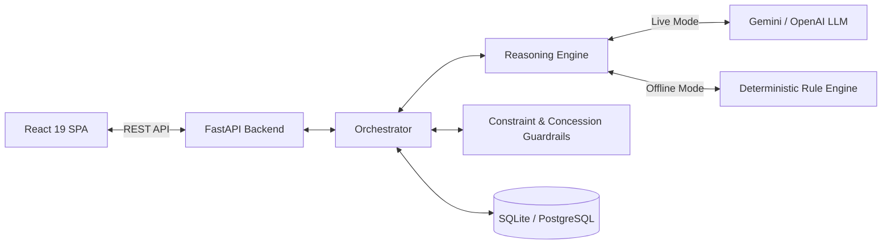

# NegoMind AI: Technical Architecture & Subsystem Documentation

Full-stack technical documentation for the **NegoMind AI** platform, covering the **React 19 + Vite Frontend**, **FastAPI Backend**, **LLM & Rule Reasoning Engines**, **Concession Telemetry**, and **Database Schema**.

> 🔗 **GitHub Repository**: [https://github.com/hemalathabora/Infosys-AI-Negotiation](https://github.com/hemalathabora/Infosys-AI-Negotiation)

---

## 🏗️ Core Architecture Overview

NegoMind AI connects a React 19 single-page application to a FastAPI backend that executes multi-round negotiations via structured state management.



---

## 🤖 Dual Reasoning Engine Architecture

The reasoning engine (`backend/app/services/llm_reasoning.py`) operates in two modes:

### 1. Gemini / LLM Mode (Contextual AI)
- Uses `google-generativeai` / `google-genai` or `openai` SDKs.
- Enforces strict JSON output via Pydantic model (`LLMStructuredResponse`):
  ```json
  {
    "decision": "counter",
    "offer": { "price": 46500, "quantity": 100 },
    "reasoning": "Lowering price to move closer to buyer budget while maintaining vendor profit margin.",
    "parameters": { "target_price": 48000, "minimum_price": 42000 }
  }
  ```

### 2. Normal Mode (Deterministic Rule Engine)
- Triggered when `LLM_PROVIDER=mock` or when no valid API key is supplied.
- Evaluates offer utility, buyer/seller value direction, and personality profiles (`Aggressive`, `Collaborative`, `Risk-averse`) locally without network requests.

---

## 🔒 Constraint & Concession Safety Guardrails

To eliminate out-of-bounds proposals or hallucinations:
- **Buyer Ceiling Clamp**: Counteroffers above `maximum_price` are clamped to `maximum_price`.
- **Vendor Floor Clamp**: Counteroffers below `minimum_price` are clamped to `minimum_price`.
- **Concession Control Layer**: `apply_concession_control` bounds step concession sizes based on persona coefficients (`MAX_STEP_RATIO`).

---

## 🔄 Orchestration Lifecycle

```
1. Fetch Active Session State & History from Database
2. Identify Current Turn Agent Profile & Opponent Offer
3. Invoke Reasoning Engine (LLM or Normal Rule Engine)
4. Validate & Clamp Output via Constraint Guardrails
5. Record Step Concession Telemetry & Check Deadlock Engine
6. Persist Turn Entry to Database Transcript
7. Check Termination Conditions (Accept, Reject, Max Rounds)
8. Switch Active Turn Agent or Transition Session Status
```

---

## 📊 Concession Telemetry Math

Concession calculations are implemented in `backend/app/services/concession_tracking.py`:

- **Step Concession**: Absolute price movement toward target zone.
- **Step Percentage**: Percentage of overall target range covered in a turn.
- **Cumulative Concession**: Sum of true step concessions across rounds.
- **Rate of Decay**: $\frac{\text{Avg(Early Steps)} - \text{Avg(Recent Steps)}}{\text{Avg(Early Steps)}} \times 100\%$.
- **ZOPA**: $\text{Max}_{\text{Buyer}} - \text{Min}_{\text{Vendor}}$.

---

## 📡 REST API Summary

- `POST /api/negotiations` — Start simulation or practice session
- `GET /api/negotiations/{id}` — Fetch session state & current turn
- `POST /api/negotiations/{id}/turn` — Execute single turn
- `POST /api/negotiations/{id}/practice-turn` — Submit human offer
- `POST /api/negotiations/{id}/run` — Auto-run session to completion
- `GET /api/analytics/{id}` — Fetch session concession metrics
- `POST /api/settings/mode` — Dynamically switch between Gemini and Normal modes

---

## 🧪 Testing

Run pytest suite from `backend/`:
```bash
python -m pytest tests -v
```
All 62 tests across 12 test modules pass cleanly.

---

## 🌐 Deployment Configuration

- **Frontend**: Hosted on Vercel (`vercel.json`).
- **Backend**: Hosted on Render (`render.yaml` & `Procfile`).
- **Database**: SQLite default or PostgreSQL via `DATABASE_URL`.
