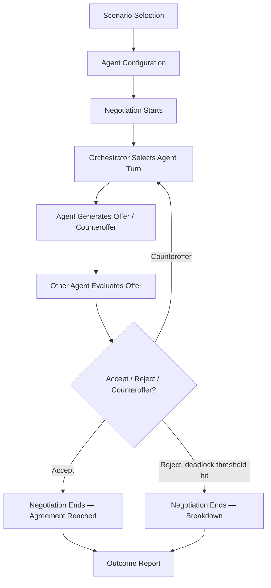

# 1. Basic System Workflow

This is the end-to-end flow a single negotiation session follows, from scenario
pick to the final outcome report. It's the backbone the Orchestrator Agent
(built in Milestone 2) will implement.

## Flow diagram

## Step-by-step notes

| Step | What happens | Owned by |
|---|---|---|
| **Scenario Selection** | User picks one of the three pre-built templates (vendor pricing, job offer, budget allocation). Loads the default agents, roles, and constraints for that scenario. | Scenario Selection Module |
| **Agent Configuration** | User reviews/edits agent personas — role, goal, constraint, personality — before the negotiation begins. | Agent Configuration Module |
| **Negotiation Starts** | Orchestrator initializes negotiation state: round counter = 0, empty transcript, both agents' constraints loaded. | Orchestrator Agent |
| **Orchestrator Selects Agent Turn** | Orchestrator determines whose turn it is (alternating, or first-mover rule per scenario) and passes it the full conversation history. | Orchestrator Agent |
| **Agent Generates Offer / Counteroffer** | The active LLM agent reasons over its persona + goals + history and produces a concrete offer. | Agent Reasoning & Offer Generation Engine |
| **Other Agent Evaluates** | The receiving agent (LLM or human, in Practice Mode) evaluates the offer against its own objectives and constraints. | Counteroffer Evaluation & Concession Module |
| **Accept / Reject / Counteroffer** | Three possible outcomes per round. Counteroffer loops back to the Orchestrator for the next turn. Reject past a deadlock threshold ends the negotiation. | Counteroffer Evaluation Module + Deadlock Detection Module |
| **Negotiation Ends** | Triggered either by mutual acceptance or by the Deadlock Detection Module after N stalled rounds. | Orchestrator Agent |
| **Outcome Report** | Final terms (or breakdown notice), concession timeline, rounds elapsed, and per-agent objective satisfaction score are generated. | Outcome Evaluation & Report Generation Module |

## Design notes for Milestone 2

- The loop between **Orchestrator → Offer → Evaluate → Counteroffer** is the
  core engine; it should be scenario-agnostic so all three templates run
  through the same code path.
- Deadlock Detection watches round count against a configurable threshold
  (e.g. no movement in either party's position for 3 consecutive rounds).
- Practice Mode swaps one LLM agent's "Generates Offer" / "Evaluates" step
  for a human input step — the rest of the flow is unchanged.
